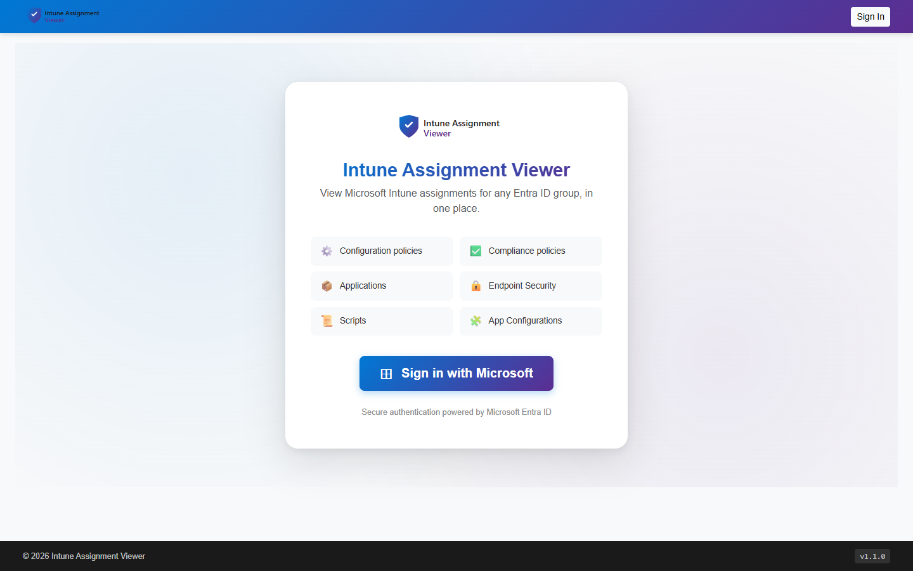
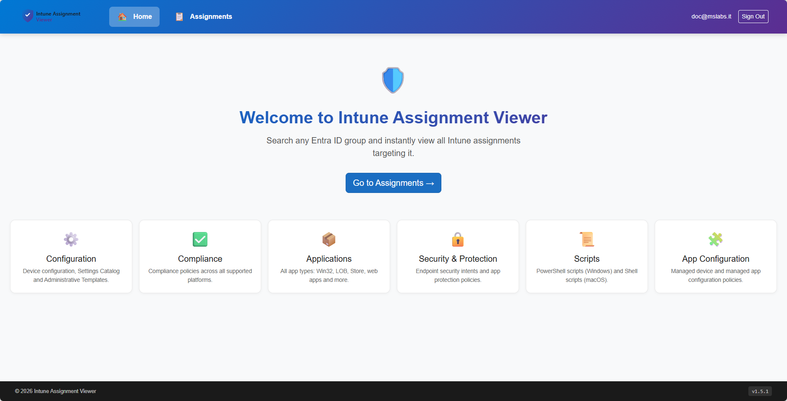
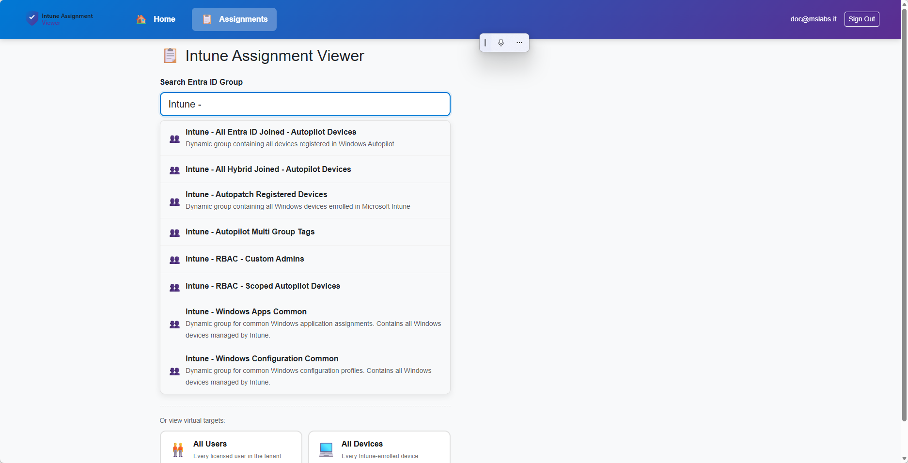
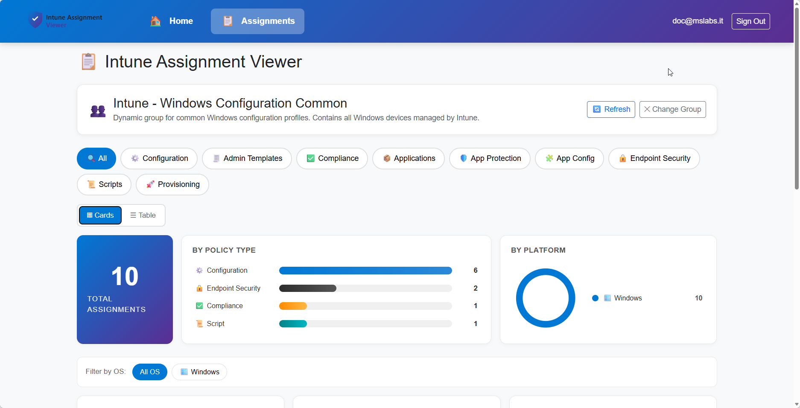
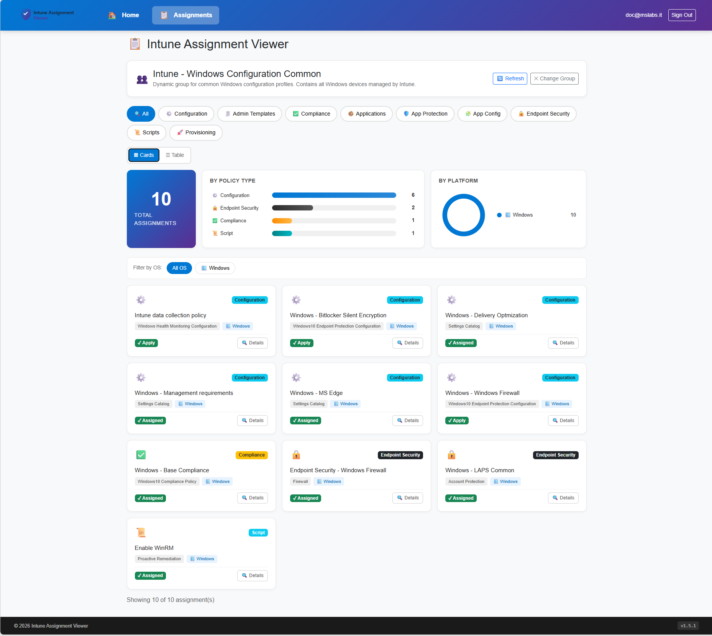
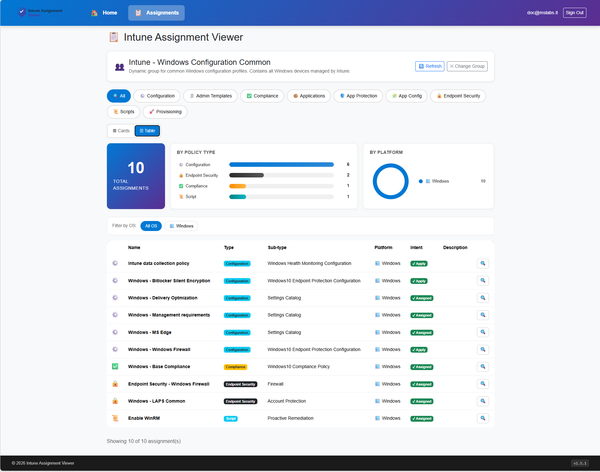
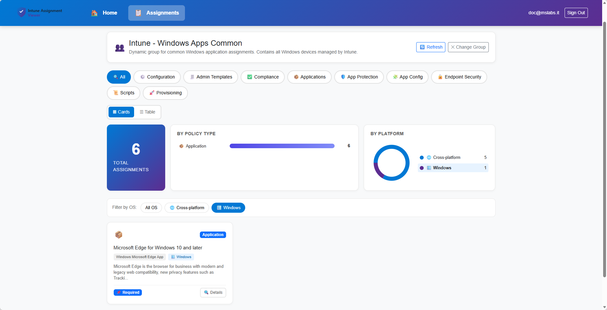

<div align="center">


# Intune Assignment Viewer

**A modern Blazor web portal to inspect every Microsoft Intune assignment targeting an Entra ID group — at a glance.**

[](https://dotnet.microsoft.com/)
[](https://dotnet.microsoft.com/apps/aspnet/web-apps/blazor)
[](https://learn.microsoft.com/graph/)
[](https://learn.microsoft.com/mem/intune/)
[](https://azure.microsoft.com/products/app-service)
[](https://learn.microsoft.com/iis/)
[](LICENSE)

[Features](#-features) • [Screenshots](#-screenshots) • [Architecture](#-architecture) • [Deploy on Azure](#-azure-app-service-deployment) • [Deploy on-prem](#-on-premises-iis-deployment) • [Configuration](#-configuration-reference) • [Credits](#-credits)

</div>

---

## 🎯 Why this exists

Intune admins routinely need to answer one simple question:

> *"What policies, profiles, scripts and apps does this Entra ID group actually receive?"*

The Intune portal scatters that information across **a dozen blades**. This tool puts it all on **one screen**.

## ✨ Features

- 🔐 **Entra ID sign-in** with role-based access control (only users with the configured app role can enter)
- 🔎 **Live group search** — debounced, results appear as you type
- 🎴 **Two views** — switch between **card grid** (visual) and **table** (dense) with one click
- 🗂️ **Complete policy coverage** — 9 categories, 15+ Graph endpoints:

  | Category | What's included |
  |---|---|
  | ⚙️ **Configuration** | Device Configurations + Settings Catalog |
  | 🧾 **Administrative Templates** | ADMX (`groupPolicyConfigurations`) |
  | ✅ **Compliance** | All compliance policies, all platforms |
  | 📦 **Applications** | Win32, MSI, LOB, Store, Web, iOS/Android — full `mobileApps` set |
  | 🛡️ **App Protection** | iOS / Android / Windows MAM + WIP |
  | 🧩 **App Configuration** | Managed device & managed app configurations |
  | 🔒 **Endpoint Security** | Antivirus, Disk Encryption, Firewall, EDR, ASR, Account Protection — **both** Settings Catalog and template-style intents |
  | 📜 **Scripts** | PowerShell (Windows), Shell (macOS), Proactive Remediations |
  | 🚀 **Provisioning** | Autopilot profiles, Enrollment Status Page, Cloud PC (Windows 365) |

- 🏷️ **Rich metadata** — each row shows policy sub-type (e.g. *Win32 LobApp*, *EDR*, *Settings Catalog*), platform with icon (🪟 🍎 🖥️ 🤖), and real assignment intent (Required / Available / Uninstall / Exclude)
- ☁️ **Hybrid auth model** — App Registration for **user sign-in**, Managed Identity (Azure) **or** Client Secret (on-prem) for **Graph API**
- 🎨 **Customizable branding** — logo and app title via `appsettings.json`
- 🏷️ **Version visible** — shown in the footer, sourced from the assembly informational version

## 📸 Screenshots

### 🔐 Splash / Sign-in page

<p align="center">
  
</p>

### 🏠 Authenticated home

<p align="center">
  
</p>

### 🔎 Live group search

<p align="center">
  
</p>

### 📊 Summary dashboard

Once a group is selected, a dashboard appears with totals, a bar chart of assignments by policy type (click a bar to filter), and a donut chart by platform (click the legend to filter by OS).

<p align="center">
  
</p>

### 🎴 Card view & ☰ Table view

<p align="center">
  
  
</p>

### 🧮 OS filter

<p align="center">
  
</p>

> 💡 To re-capture or contribute screenshots, see [`docs/screenshots/README.md`](docs/screenshots/README.md).

## 🏛️ Architecture

```
┌──────────────────────────────────────────────────────────────────┐
│                          Browser (HTTPS)                          │
└────────────────────────────────┬─────────────────────────────────┘
                                 │
                                 ▼
┌──────────────────────────────────────────────────────────────────┐
│  Blazor Server (ASP.NET Core 10)                                 │
│  ┌──────────────────────────┐    ┌─────────────────────────────┐ │
│  │  Microsoft.Identity.Web  │    │  IntuneService (Graph beta) │ │
│  │  OIDC / Cookie / Roles   │    │  9 policy categories        │ │
│  └────────────┬─────────────┘    └─────────────┬───────────────┘ │
└───────────────┼──────────────────────────────────┼────────────────┘
                │                                  │
                ▼                                  ▼
   ┌───────────────────────┐         ┌───────────────────────────┐
   │  Entra ID (OIDC)      │         │  Microsoft Graph API      │
   │  App Registration #1  │         │  Managed Identity (Azure) │
   │  → user sign-in only  │         │  Client Secret (on-prem)  │
   └───────────────────────┘         └───────────────────────────┘
```

**Two-credential design** — sign-in and Graph queries use *separate* identities, so the app never holds delegated Graph tokens.

## 🚀 Azure App Service deployment

Recommended setup — uses **system-assigned Managed Identity** for Graph (no secrets to rotate).

1. **Create resources**

   ```bash
   az group create -n rg-intune-viewer -l westeurope
   az appservice plan create -g rg-intune-viewer -n asp-intune-viewer --is-linux --sku P1V2
   az webapp create -g rg-intune-viewer -p asp-intune-viewer -n <your-app-name> --runtime "DOTNETCORE:10.0"
   az webapp config set -g rg-intune-viewer -n <your-app-name> --startup-file "dotnet IntuneAssignmentViewer.dll"
   az webapp identity assign -g rg-intune-viewer -n <your-app-name>
   ```

2. **Grant Graph permissions to the Managed Identity** — `Group.Read.All`, `DeviceManagementConfiguration.Read.All`, `DeviceManagementApps.Read.All`, `DeviceManagementServiceConfig.Read.All`.

3. **Create the sign-in App Registration**, enable **ID token issuance**, add app role `IntuneReader`, and assign it to your admin group.

4. **Deploy:**
   ```bash
   dotnet publish -c Release -o ./publish
   Compress-Archive -Path ./publish/* -DestinationPath ./deploy.zip
   az webapp deploy -g rg-intune-viewer -n <your-app-name> --src-path ./deploy.zip --type zip
   ```

## 🖥️ On-premises (IIS) deployment

Same codebase, runs on Windows Server with IIS.

1. Install the [.NET 10 Hosting Bundle](https://dotnet.microsoft.com/download/dotnet/10.0).
2. Publish: `dotnet publish -c Release -o C:\inetpub\IntuneAssignmentViewer`
3. In IIS Manager → **Add Website**, point to that folder, app pool set to **"No Managed Code"**.
4. Bind **HTTPS** (TLS certificate required — OIDC needs it).
5. Update the App Registration **Redirect URI** to `https://<your-host>/signin-oidc`.
6. Configure `appsettings.json` with a **Client Secret** for Graph (Managed Identity isn't available on-prem):

   ```jsonc
   "Graph": {
     "TenantId": "<tenant-id>",
     "ClientId": "<graph-app-client-id>",
     "ClientSecret": "<secret>"
   }
   ```

> 💡 The included `web.config` configures `AspNetCoreModuleV2` in-process hosting plus security headers.

## ⚙️ Configuration reference

```jsonc
{
  "AzureAd": {                    // Sign-in App Registration (always required)
    "Instance": "https://login.microsoftonline.com/",
    "TenantId": "<tenant-id>",
    "ClientId": "<sign-in-app-client-id>",
    "CallbackPath": "/signin-oidc"
  },
  "Graph": {                      // Leave empty -> Managed Identity (Azure)
    "TenantId": "",               // Set all 3 -> Client Secret (on-prem)
    "ClientId": "",
    "ClientSecret": ""
  },
  "Authorization": {
    "RequiredRole": "IntuneReader"  // App role required to access the portal
  },
  "CookiePolicy": {
    "Secure": "Always"            // Use "SameAsRequest" for local HTTP dev
  },
  "Branding": {
    "LogoPath": "/images/logo.svg",
    "AppTitle": "Intune Assignment Viewer"
  }
}
```

## 🛠️ Tech stack

- **[.NET 10](https://dotnet.microsoft.com/)** + **[Blazor Server](https://dotnet.microsoft.com/apps/aspnet/web-apps/blazor)** (interactive server components)
- **[Microsoft.Identity.Web](https://github.com/AzureAD/microsoft-identity-web)** — OIDC sign-in
- **[Microsoft Graph SDK v5](https://github.com/microsoftgraph/msgraph-sdk-dotnet)** + raw beta endpoint calls
- **[Azure.Identity](https://github.com/Azure/azure-sdk-for-net/tree/main/sdk/identity/Azure.Identity)** — `ChainedTokenCredential` (ManagedIdentity → AzureCli → VisualStudio) or `ClientSecretCredential`
- **Bootstrap 5** + custom CSS (gradient navbar, card/table views)

## 🤝 Contributing

Issues and PRs welcome! Some ideas on the roadmap:
- [ ] Filter assignments (transitive group membership / parent groups)
- [ ] Export results to CSV / JSON
- [ ] Reverse lookup: *"which groups receive this policy?"*
- [ ] Assignment filters display
- [ ] Multi-tenant support
- [ ] Scope tag filtering

## 🙏 Credits

Graph endpoint coverage was inspired by Ugur Koc's excellent PowerShell module [**IntuneAssignmentChecker**](https://github.com/ugurkocde/IntuneAssignmentChecker). If you prefer a CLI/PowerShell experience, check it out!

## 📄 License

[MIT](LICENSE) — Free to use, modify, and redistribute.

---

<div align="center">

**Keywords:** `intune` `microsoft-intune` `entra-id` `azure-ad` `mdm` `mam` `endpoint-management` `microsoft-graph` `graph-api` `blazor` `blazor-server` `dotnet` `dotnet10` `aspnet-core` `web-app` `azure` `azure-app-service` `managed-identity` `iis` `on-premises` `intune-policies` `intune-assignments` `device-management` `endpoint-security` `autopilot` `windows-365` `cloud-pc` `settings-catalog` `compliance-policies` `app-protection` `proactive-remediations`

Made with ❤️ for Intune administrators

</div>
